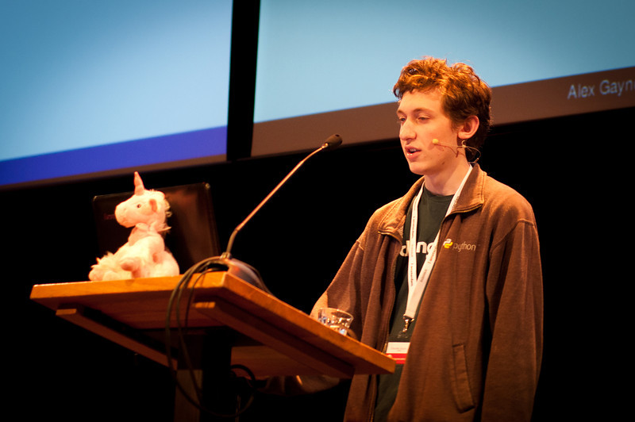
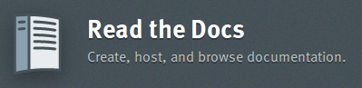

__doc__ "para todos y todas"
=================================

Quién soy
---------

- A veces me lo pregunto
- Soy Martín (a.k.a. *tin_nqn*)

  - un hincha de Boca
  - y de Python
  - un ingeniero que trabaja en Machinalis
  - y está creando Phasety :)
 

Qué hago acá
-------------

A veces me lo pregunto :)

- Vine a compartir algunas ideas:

  - Programar está buenísimo (¡más con Python!)
  - A programar se aprende programando
  - Pero se empieza y se programa mejor cuando hay ayuda
  - Ayuda = amigos geeks + documentación!
  
La mala fama
------------
 

.. leer manuales es aburrido
   la culpa no es del chancho sino del que le da de comer

Un cambio de paradigma
------------------------

- Documentación que de gusto leer
- Accesible, precisa y exhaustiva
- Todoterreno: de presentación, guia y referencia

- O sea... ¡Nos gusta la documentación pythónica!

Pero ¿existe?
--------------

.. epigraph::

    I can say unequivocally that I came to Django because of the docs. 

    -- Alex Gaynor [1]_

   	

¡Ya hay mucha!
--------------

- Por ejemplo en ReadTheDocs.org !
 
  - http://*<proyecto>*.rtfd.org

Y por casa, cómo andamos?
-------------------------

- Aprendamos a escribir [documentación].
- Nadie conoce tu proyecto más que vos
- Podés conseguirte un Alan Gaynor
- Y te hace mejor desarrollador, persona y héroe mío

- Ah, casi me olvido

.. epigraph::

   Cuando tengas algo que decir, dilo; cuando no, también. Escribe siempre.

   -- Augusto Monterroso, *Decálogo del escritor*

Primero lo primero
-------------------

.. epigraph::  

	Please, write me. 
	
	-- README.txt

- Es obligatorio para PyPi, github y bitbucket. 
- Pero sobre todo **es útil** para tus usuarios y para vos

  - Escribilo *ANTES* de programar

y luego, qué escribo?
----------------------
	

Tutorial paso a paso
--------------------

- Que sea rápido y de "alto nivel":
	
  - Regla de los 20'
	
- Qué funcione fácil:
 
  - No sólo en tu máquina de desarrollo. 
	
- Pero que no sea tan fácil:
	
  - No alientes choques contra la pared
  - Conocé tu *target* de usuarios

- Y *pelá* (un poquito) de todo

  - Un paseo completo que muestre como se **siente** usarlo.

Guias temáticas
---------------

- Acá está la sustancia
- Separá por áreas conceptuales
- **Exhaustividad**
- No minuciosidad
- ¡Ejemplos!

Referencia
-----------

- La API
- Para el que ya sabe *cómo*
- pero quiere saber/recordar el parámetro exácto
- O una configuración particular

Documentar en el código
-----------------------

::

	>>> class Ejemplo(object):
			
			"""Es fácil y útil"""
		
			def mostrar(self):
				"""muestra un ejemplito"""
				
				return self.mostrar.__doc__

	>>> Ejemplo().mostrar()
	'muestra un ejemplito'

¿Y con qué escribo?
-------------------

- Teclado
- RestructuredText 

  - El latex de los pythonistas		

- Sphinx_ ! 

.. epigraph::

   Cheers for a great tool that actually makes programmers want to write documentation!
   
   -- Sphinx users

Y cómo comparto?
----------------

- Versioná los .rst con el proyecto
- Y publicá en readthedocs.org_

  - Actualiza cuando hay cambios en tu repo
  - No tenes que tener Sphinx
  - Guarda versiones previas
  - Multiples formatos (PDF, epub, etc.)

- http://pages.github.com tambien es una opción
- No olvides un link en tu README.txt

Ultima bajada de línea
----------------------

- Bugs son bugs. Tambien en la docu.

  - Corregilos. (propios y ajenos)

- Un feature cerrado se compone de 
 
  - implementación
  - tests
	
    - (o al revés)
	
  - y su **documentación**

- Si no está actualizado no sirve

Truquitos
----------

- RTD command line:: 
	 
	pip install rtd
	rtd pip
	rtd pip git 

- Links profundos

  - Ejemplo: http://pip.rtfd.org/git  
  - Editado por humanos (vos?)
  - como http://django.me/*<algo>*
 
Difunde la palabra
-------------------

.. epigraph::

   We can help spread this culture throughout the Python world, and beyond.
	
   -- Eric Holscher [2]_

	
Referencias
-------------
.. _Sphinx : http://sphinx.pocoo.org
.. _readthedocs.org : http://readthedocs.org
.. [1] http://jacobian.org/writing/great-documentation/what-to-write/

.. [2] http://ericholscher.com/blog/2012/jan/22/why-read-docs-matters/
.. [3] http://read-the-docs.readthedocs.org/en/latest/index.html

 
